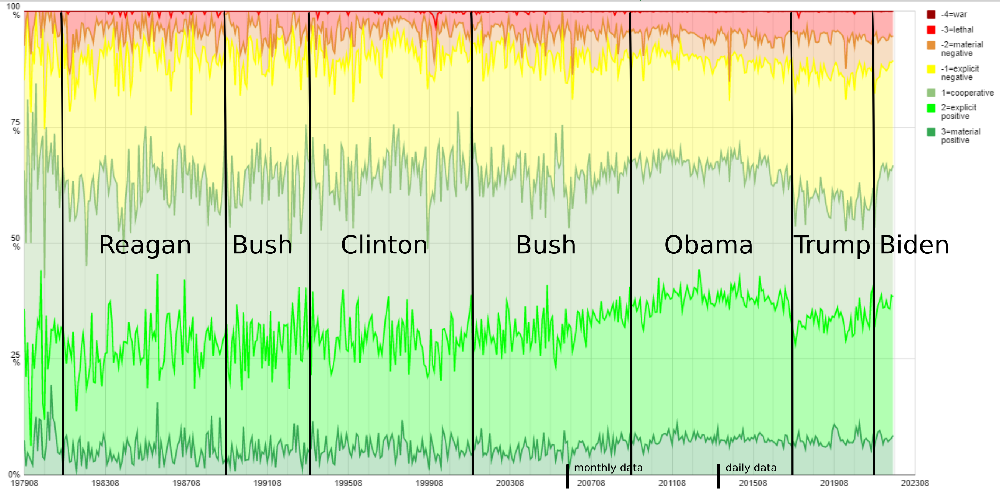

# Analyze GDELT data for presidential conduct

The GDELT data contains summaries of press communication.
These summaries include 
* date and time
* location
* involved parties
* a coding of the reported activity

This data is filtered for mentions of the US president
(one clearly identifiable actor).
The activity coding of the resulting records is translated into a 
positive/negative rating according to the following scheme:

* +3 materially positive (improving situation)
* +2 explicitly positive
* +1 potentially positive (cooperative)
*  0 neutral
* -1 explitly negative
* -2 materially negative
* -3 lethal

See source for more details.

# Usage

Download all GDELT data files from the 
[GDELT data site](http://data.gdeltproject.org/events/).
This can be conveniently done with the helper script 

    bash download_gdelt.sh

While the download runs you can build the application with

    mvn install

Then run

    java -jar target/gdelt-1.0-SNAPSHOT-with-dependencies.jar \
        <path-to-download-dir> <file-pattern> <output-csv-file> {filter}*

The file-pattern is a Java RegEx and should usually be ".*zip".
The filter can be a comma-separated list of
* ALL = unfiltered
* RELIG = any religious group/actor
* ETHNIC = any ethnic group/actor
* JEW = Jewish group/actor
* MOS = Muslim group/actor
* CHR = Christian group/actor

Ethnic group codes can also be given but it is recommended to just zse ETHNIC
due to the high number of ethic groups.

For more see [GEDELT CAMEO Manual](https://www.gdeltproject.org/data/documentation/CAMEO.Manual.1.1b3.pdf)

# Examples
Quick results for 2021:

    java -jar target/gdelt-1.0-SNAPSHOT-with-dependencies.jar . "2021.*zip" out2021 ALL

Full processing for multiple filter targets (may take multiple hours):

    java -jar target/gdelt-1.0-SNAPSHOT-with-dependencies.jar . ".*zip" out ALL,MOS,CHR,JEW,ETHNIC

The examples assume that the download has been run in the main directory (".").

# Output

The output file contains the number of the mentions of the US president
in the GDELT data set aggregated per month. 
For each rating level the number of presidential acts during that month is tallied.
This can be easily diagrammed with a tool of your choice.

Best results with a 100% stacked diagram excluding neutral counts. 

Here is an example with filter "ALL":

